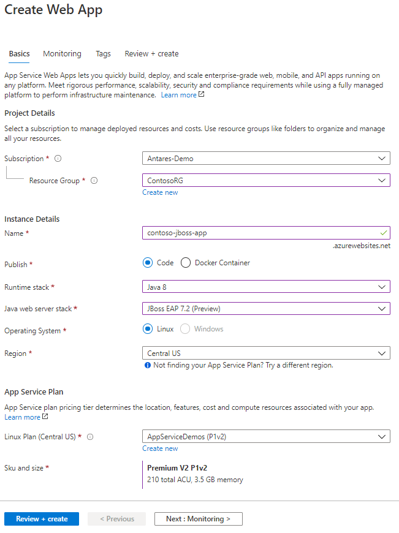

# JBoss EAP on App Service demo

> Have feedback for us? [Email us!](mailto:java-on-app-service@microsoft.com)

## Prerequisites

To follow this tutorial, you will need...

- Java installed locally
- Maven installed locally
- An Azure subscription

Throughout this tutorial you will create an Azure App Service Plan and an Azure PostgreSQL server.

## Tutorial

This tutorial will walk through the process of creating a JBoss EAP site on App Service, deploying a WAR application, and configuring the JBoss EAP server to connect to a PostgreSQL database.

### Create a JBoss EAP site

1. Open to the Azure Portal to the [Web App create blade](https://portal.azure.com/#create/Microsoft.WebSite). For **Runtime stack**, select **JBoss EAP 7.2 (Preview)**.
    
    
2. Once the site is created, browse to the site and you should see the default (aka "parking") page.
   

3. Open a terminal and clone the Pet Store demo application. We will deploy this app onto the JBoss EAP App Service.

    ```bash
    git clone https://github.com/agoncal/agoncal-application-petstore-ee7.git
    ```

4. Build the WAR file with `mvn clean install -DskipTests`.

5. Deploy the war file to your web app. First, change directories into the sample project, `cd agoncal-application-petstore-ee7`.

    **Powershell**

    ```powershell
    Publish-AzWebapp -ResourceGroupName <group-name> -Name <app-name> -ArchivePath agoncal-application-petstore-ee7\target\applicationPetstore.war
    ```

    **Bash**

    For bash, you will need to copy the username and password from your app's [publishing credentials](https://docs.microsoft.com/en-us/azure/app-service/deploy-configure-credentials).

    ```bash
    curl -X POST -u <username> --data-binary @"<war-file-path>" https://<app-name>.scm.azurewebsites.net/api/wardeploy
    ```

6. Browse to your web app and confirm that the app is now running. This app is using an in-memory H2 database by default. Let's now create a PostgreSQL database and connect it to the application.

### Create a PostgreSQL server and database

1. Run the following command to create a Azure Database for PostgreSQL server.

    ```bash
    az postgres server create --resource-group <group-name> --name mydemoserver --location westus --admin-user myadmin --admin-password <server_admin_password> --sku-name GP_Gen5_2
    ```

1. In the "Connection security" panel of the Azure Database blade, toggle the "Allow access to Azure services" button to the "ON" position.

### Configure JBoss EAP for PostgreSQL

1. Next, we need to edit our Java Transaction API configuration so that our Java application will communicate with Postgres instead of the in-memory H2 database we were using previously. Open an editor to [`src/main/resources/META-INF/persistence.xml`](agoncal-application-petstore-ee7/src/main/resources/META-INF/persistence.xml). Replace the value for `<jta-data-source>` with `java:jboss/datasources/postgresDS`. Your JTA XML should now have this setting:

    ```xml
    <jta-data-source>java:jboss/datasources/postgresDS</jta-data-source>
    ```

1. Create three app settings on the site:

    - `POSTGRES_CONNECTIONURL`: The connection URL for the server, the format should look like `jdbc:postgresql://freebergserver123.postgres.database.azure.com:5432`.
    - `POSTGRES_USERNAME`: The username for the server (provided in the previous command)
    - `POSTGRES_PASSWORD`: The password for the server (provided in the previous command)

1. Before deploying our reconfigured application, we must update the JBoss application server with the Postgres module and its dependencies. To configure the server we will need the four files in the  [`db_config/`](db_config/) directory:

    - **postgresql-42.2.12.jar**: This .jar is the JDBC driver for Postgres. For more information, please see the [official website](https://jdbc.postgresql.org/index.html).
    - **postgres-module.xml**: This XML file declares a name for the Postgres module (org.postgres). It also specifies the resources and dependencies necessary for the module to be used.
    - **startup_script.sh**: Finally, this shell script will be executed whenever your App Service instance is started. The script runs the JBoss CLI commands to configure the server with the data source module, driver, and expose the JNDI name.
    - **jboss-cli-commands.cli**: The JBoss CLI commands that will be executed by the startup script.

1. Using an FTP tool of your choice, transfer the files in `db_config/` to `/home/site/deployments/tools/`.

1. In the App Service blade navigate to the "Application settings" panel. Under "Runtime", set the "Startup File" field to `/home/site/deployments/tools/startup_script.sh`. This will ensure that the shell script is run when the container starts.

1. Restart the web app.

1. Update [`persistence.xml`](agoncal-application-petstore-ee7/src/main/resources/META-INF/persistence.xml)

    ```xml
    ...
        <jta-data-source>java:jboss/datasources/postgresDS</jta-data-source>
    ...
    ```

11. Repackage and redeploy

    **PowerShell**
    
    ```bash
    mvn clean install -DskipTests
    Publish-AzWebapp -ResourceGroupName <group-name> -Name <app-name> -ArchivePath agoncal-application-petstore-ee7\target\applicationPetstore.war
    ```
    
    **Bash**
    
    ```bash
    mvn clean install -DskipTests
    curl -X POST -u <username> --data-binary @"<war-file-path>" https://<app-name>.scm.azurewebsites.net/api/wardeploy
    ```

## Resources

- [Petstore Application](https://github.com/agoncal/agoncal-application-petstore-ee7)
- [Quickstart for Azure PostgreSQL](https://docs.microsoft.com/en-us/azure/postgresql/quickstart-create-server-database-azure-cli)
- [Old quickstart for Wildfly](https://github.com/JasonFreeberg/agoncal-application-petstore-ee7/blob/master/temp_quickstart_steps.md)
- [JBoss CLI official documentation](https://access.redhat.com/documentation/en-us/red_hat_jboss_enterprise_application_platform/7.0/html-single/management_cli_guide/#how_to_cli)
